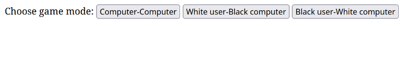
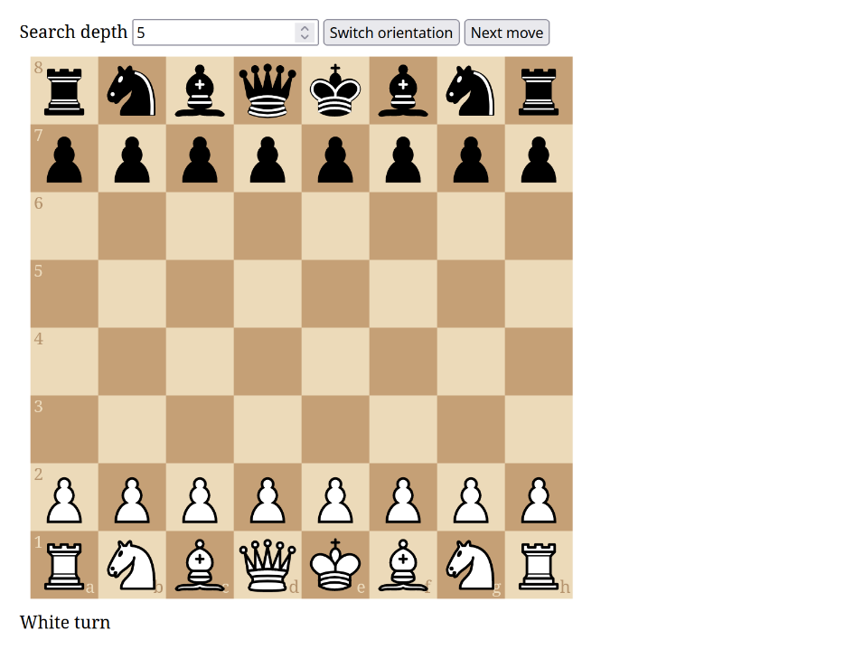
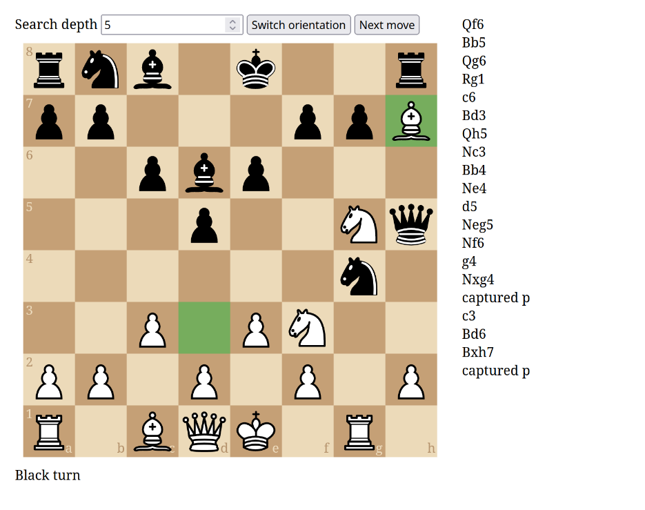
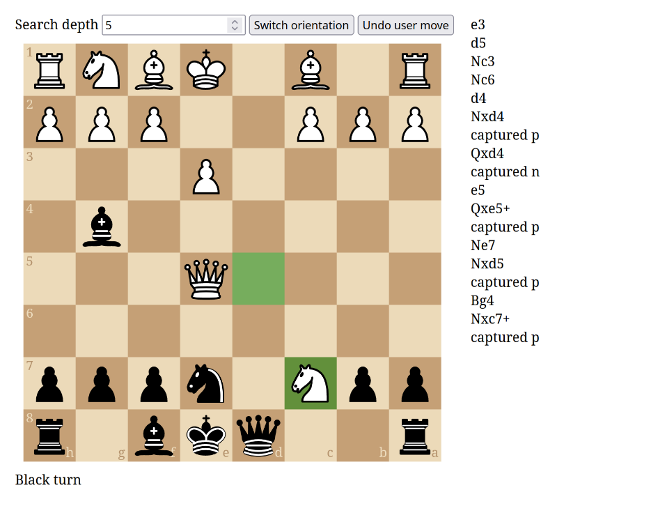

# chess-alpha-beta

Chess solver in Rust based on negamax variant of minimax algorithm with alpha-beta
pruning optimization. For the minimax details refer to
[here](https://en.wikipedia.org/wiki/Minimax#Pseudocode). Negamax
[details](https://en.wikipedia.org/wiki/Negamax).

White player is maximizer. Black is minimizer. Total score evaluated in
[here](https://docs.rs/pleco/0.5.0/pleco/board/struct.Board.html#method.psq).

## CLI version

### Build

```bash
$ cargo run --release --bin chess-alpha-beta -- --help
```

### Help

```
Usage: chess-alpha-beta [OPTIONS] --mode <MODE>

Options:
  -d, --depth <DEPTH>
          Depth of a search tree

          [default: 6]

  -e, --evaluate-user
          Show user's potentially best move when playing with computer

  -m, --mode <MODE>
          Game mode

          Possible values:
          - cc:   Computer-Computer
          - wubc: White User-Black Computer
          - buwc: Black User-White Computer
```

Interactive commands:
- `d <N>` - change search depth;
- `e <0|1>` - evaluate user (yes or no);
- `u` - undo two half moves;

### Example

```
$ cargo run --release --bin chess-alpha-beta -- --depth 6 --mode wubc
===== 0-th move:
8| r n b q k b n r
7| p p p p p p p p
6| . . . . . . . .
5| . . . . . . . .
4| . . . . . . . .
3| . . . . . . . .
2| P P P P P P P P
1| R N B Q K B N R
------------------
 | a b c d e f g h
legal_moves = ["a2a3", "a2a4", "b1a3", "b1c3", "b2b3", "b2b4", "c2c3", "c2c4",
"d2d3", "d2d4", "e2e3", "e2e4", "f2f3", "f2f4", "g1f3", "g1h3", "g2g3", "g2g4",
"h2h3", "h2h4"], len = 20
Type white move: e2e4
black move = d7d5, value = 172
===== 2-th move:
8| r n b q k b n r
7| p p p . p p p p
6| . . . . . . . .
5| . . . p . . . .
4| . . . . P . . .
3| . . . . . . . .
2| P P P P . P P P
1| R N B Q K B N R
------------------
 | a b c d e f g h
legal_moves = ["a2a3", "a2a4", "b1a3", "b1c3", "b2b3", "b2b4", "c2c3", "c2c4",
"d1e2", "d1f3", "d1g4", "d1h5", "d2d3", "d2d4", "e1e2", "e4d5", "e4e5", "f1a6",
"f1b5", "f1c4", "f1d3", "f1e2", "f2f3", "f2f4", "g1e2", "g1f3", "g1h3", "g2g3",
"g2g4", "h2h3", "h2h4"], len = 31
Type white move: b1c3
black move = d5e4, value = 235
===== 4-th move:
8| r n b q k b n r
7| p p p . p p p p
6| . . . . . . . .
5| . . . . . . . .
4| . . . . p . . .
3| . . N . . . . .
2| P P P P . P P P
1| R . B Q K B N R
------------------
 | a b c d e f g h
...
(two hours later)
...
===== 24-th move:
8| r . . . k b n r
7| p . p n p p p p
6| . . . . . . . .
5| . . . . . . . .
4| . . . P . . . .
3| . . . . . . . .
2| P P q . B P P P
1| R . B . . K R .
------------------
 | a b c d e f g h
legal_moves = ["a1b1", "a2a3", "a2a4", "b2b3", "b2b4", "c1d2", "c1e3", "c1f4",
"c1g5", "c1h6", "d4d5", "e2a6", "e2b5", "e2c4", "e2d1", "e2d3", "e2f3", "e2g4",
"e2h5", "f1e1", "f2f3", "f2f4", "g1h1", "g2g3", "g2g4", "h2h3", "h2h4"], len = 27
Type white move: f1e1
black move = e7e6, value = -3271
===== 26-th move:
8| r . . . k b n r
7| p . p n . p p p
6| . . . . p . . .
5| . . . . . . . .
4| . . . P . . . .
3| . . . . . . . .
2| P P q . B P P P
1| R . B . K . R .
------------------
 | a b c d e f g h
legal_moves = ["a1b1", "a2a3", "a2a4", "b2b3", "b2b4", "c1d2", "c1e3", "c1f4",
"c1g5", "c1h6", "d4d5", "e1f1", "e2a6", "e2b5", "e2c4", "e2d1", "e2d3", "e2f1",
"e2f3", "e2g4", "e2h5", "f2f3", "f2f4", "g1f1", "g1h1", "g2g3", "g2g4", "h2h3",
"h2h4"], len = 29
Type white move: e2b5
black move = f8b4, value = -3919
===== 28-th move:
8| r . . . k . n r
7| p . p n . p p p
6| . . . . p . . .
5| . B . . . . . .
4| . b . P . . . .
3| . . . . . . . .
2| P P q . . P P P
1| R . B . K . R .
------------------
 | a b c d e f g h
legal_moves = ["c1d2", "e1f1"], len = 2
Type white move: e1f1
black move = c2d1, value = -1503293
Chechmate! Black won!
```

## Server version

### Build

```bash
# cargo run --release --bin chess-alpha-beta-server -- --help
```

### Options

```
  -b, --bind-addr <BIND_ADDR>  Host and port where to bind HTTP server [default: 127.0.0.1:8081]
```

### Example

```bash
$ cargo run --release --bin chess-alpha-beta-server -- -b 127.0.0.1:8081
[2024-06-20T11:02:37Z INFO  chess_alpha_beta_server] Server listening [127.0.0.1:8081]
[2024-06-20T11:02:37Z INFO  actix_server::builder] starting 16 workers
[2024-06-20T11:02:37Z INFO  actix_server::server] Actix runtime found; starting in Actix runtime
```

```bash
$ curl localhost:8081/api/get_best_move --json '{"search_depth": 4, "fen": "rnbqkbnr/pp1ppppp/8/2p5/4P3/8/PPPP1PPP/RNBQKBNR w KQkq c6 0 2"}'
{"m":"f1d3","value":-102}
```

## Browser frontend

### Build

```bash
$ cd front
$ npm install

# Change api_prefix as needed in src/config.ts
$ npm run build

# Serve created dist folder from a web server. For example:
$ python -m http.server -b 127.0.0.1 8080 -d dist

# Alternatively run vite dev server:
$ npm run dev -- --port 8080
```

### Example






### vim: textwidth=85
